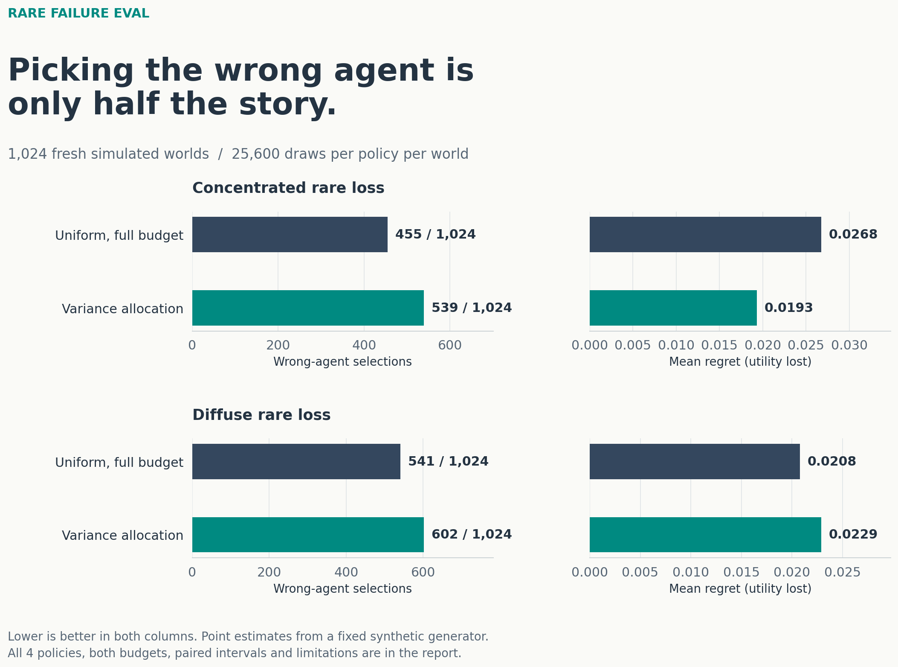

# Rare Failure Eval

A reproducible stress test for a practical agent-evaluation question:
**how often you choose the wrong agent and how costly that choice is can disagree.**

This project allocates a fixed evaluation budget across four synthetic agents and
eight tasks. Rare failures reduce utility, rather than being counted separately
from the score. Every agent is evaluated against the same fixed task distribution.



## Fresh-run finding

At 25,600 simulated draws, variance allocation chose the wrong agent more often
under concentrated risk: **539 versus 455 of 1,024 worlds**. Yet its mean regret
was lower: **0.0193 versus 0.0268**. Its mistakes were less costly on average.
Under diffuse risk it had more wrong selections and higher regret. This is a
metric tradeoff in this generator, not a general advantage for adaptation.

[Read the finding, uncertainty and full scope](FINDINGS.md).

## What is being tested?

- **Uniform, full budget:** balanced sampling with every draw used for estimation.
- **Uniform, pilot matched:** the same two-stage cost as the adaptive policies.
- **Variance allocation:** a four-draw-per-cell pilot sets a frozen, regularized
  Neyman allocation. A uniform floor keeps every task represented.
- **Follow pilot failures:** spend more where the pilot observed a failure;
  otherwise fall back to uniform allocation within each agent.

The target is expected utility, `reward - 800 * failure`, under known task weights.
A wrong selection is a binary error. Simple regret measures how much expected
utility was lost by that selection. Neither metric replaces a safety constraint.

The fresh-seed run has 1,024 randomized worlds, three risk settings and two budgets
(6,400 and 25,600 simulated draws per policy per world). Its complete grid has
24,576 records and 393,216,000 simulated draws. These are arithmetic simulations,
not calls to language models or measurements of deployed agents.

## Reproduce

Tested with Python 3.13. CPU only; no credentials or API.

```sh
python3.13 -m venv .venv
.venv/bin/python -m pip install -r requirements.txt
.venv/bin/python -m pytest -q
.venv/bin/python run_experiment.py --mode smoke --out outputs/smoke
.venv/bin/python run_experiment.py --mode primary --approved-primary --out outputs/replication
.venv/bin/python run_experiment.py --verify --out outputs/replication
.venv/bin/python independent_audit.py outputs/replication
.venv/bin/python make_figures.py outputs/replication/summary.json --out figures
```

Output directories must be new. The explicit primary flag is an execution gate,
not proof of peer review. The runner writes a manifest before sampling, hashes the
source and artifacts, enforces the complete fixed grid and rejects partial runs.
The independent audit reconstructs weighted estimates, rankings, tie handling,
selection error and regret from saved sufficient statistics without importing the
simulation or reporting implementation.

## Read the results

- [Complete comparison](results/REPORT.md): every policy, scenario and budget.
- [Full summary](results/summary.json): 288 condition/metric means and all 432
  paired contrasts, including undefined values explicitly represented as null.
- [Protocol](PROTOCOL.md): generator, costs, estimator, intervals and assumptions.
- [Reconstruction audit](results/audit.json): complete grid and primary metrics.
- [All conditions](figures/all_conditions.png): full visual comparison.

Compressed raw records and the collection manifest are in `results/`. To verify
the distributed run, copy that directory to a new location, decompress
`results.jsonl.gz` there to `results.jsonl`, then run the verifier on that directory.
Keep the other manifest and completion files alongside it. Exact source and
package versions matter for deterministic replay.

## Interpretation limits

This is an exploratory fresh-seed replication of an earlier 128-world pilot.
The plan was written before inspecting the new seeds; it was not publicly
preregistered. More seeds check Monte Carlo stability inside the same generator,
not transfer to real agents. The risk settings do not match total event mass, so
concentrated versus diffuse risk is not a controlled causal comparison.

Four pilot draws have only a 0.4% chance of observing a failure with probability
0.001 in a cell. Zero observed failures do not establish safety. Point estimates
use fresh second-stage samples and fixed task weights; selecting their maximum
can still introduce optimism. Paired bootstrap intervals are descriptive and
unadjusted. Binomial risk intervals are one-look bounds, not anytime guarantees.
The variance-directed allocation is not a best-arm optimal algorithm.

## Inspiration

[Active Evaluation of General Agents](https://arxiv.org/abs/2601.07651v2),
Lanctot et al. (2026), frames evaluation as a sampling-allocation problem. This is
an independent synthetic extension, not a replication of its Elo or Soft
Condorcet algorithms. No employer data or institutional endorsement is involved.
